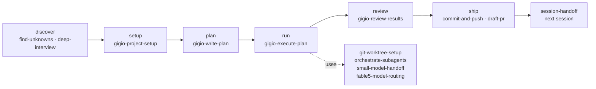

# gigio-pack

A self-contained agent skill pack for solo development with AI coding agents
(Claude Code / Codex / Cursor). It keeps project intent and plans durable
across sessions and models, and covers the work loop — discovery, setup,
planning, parallel execution, review, shipping. 13 skills, all human-readable
markdown.

The pack is deliberately limited to the loop. Craft skills (docs, docstrings,
diagrams, UI, terminology, prompt review) and skill-authoring tooling stay in
[gigio1023/agent-skills](https://github.com/gigio1023/agent-skills), their
canonical home — see [Scope](#scope).

[Install](#install) · [Update](#keep-the-install-current) ·
[Work loop](#the-work-loop) · [Catalog](#skill-catalog) · [Scope](#scope) ·
[Why it looks like this](#why-it-looks-like-this) · [Status](#status) ·
[Contributing](CONTRIBUTING.md)

## Install

Install globally for the agents you use:

```bash
npx --yes skills add 'gigio1023/gigio-pack#main' \
  --global \
  --agent claude-code --agent codex --agent cursor \
  --skill '*' \
  --yes
```

Drop the trailing `--yes` to review the overwrite summary in an interactive
terminal — recommended whenever the install would replace an existing global
skill of the same name. Always pass an explicit `--agent` list; the CLI
otherwise installs for whatever agent it detects.

Read the source before installing it. That advice applies to this pack as much
as to any other — see [Ecosystem caution](docs/prior-art.md#ecosystem-caution).

## Keep the install current

A global install **copies** files; it does not symlink. Installing from the
GitHub source above records the origin, so `npx skills update` picks up later
releases. Installing from a local checkout instead does not — the CLI skips
local-path installs, and re-running `add` is then the only update path.

Either way, editing a skill in a checkout changes nothing globally until you
install again.

## The work loop



Two rules hold across the pack:

- Skills reference each other **unconditionally** — the pack ships as one
  unit, so "if installed" hedging exists only for harness capabilities
  (subagent availability etc.), never for sibling skills.
- The purpose and the outcome are in the name: `gigio-write-plan` writes a
  plan, `gigio-execute-plan` executes one, `session-handoff` hands a session
  to the next one, `small-model-handoff` hands bounded work to a weaker model.

## Skill catalog

### Core loop (`gigio-` prefixed)

| Skill | Role |
| --- | --- |
| [gigio-project-setup](skills/gigio-project-setup/) | Create or audit `PROJECT.md` and the shared agent-instruction wiring |
| [gigio-write-plan](skills/gigio-write-plan/) | Write a plan file (staged tasks, file ownership, checks); never executes |
| [gigio-execute-plan](skills/gigio-execute-plan/) | Execute or resume a plan; preflight, parallel workers, run log |
| [gigio-review-results](skills/gigio-review-results/) | Fresh-context review of results against plan and intent |

### Loop stations

| Skill | Origin | Role |
| --- | --- | --- |
| [find-unknowns](skills/find-unknowns/) | renamed from `unknowns-pass` | Surface unknowns before committing to work; launch brief feeds the plan |
| [deep-interview](skills/deep-interview/) | migrated | Socratic requirements discovery; feeds setup and planning |
| [orchestrate-subagents](skills/orchestrate-subagents/) | renamed from `parallel-subagents` | Parallel-delegation judgment, packets, and synthesis |
| [small-model-handoff](skills/small-model-handoff/) | renamed from `lower-capability-executor-prompt` | Bounded prompts handing approved work to a weaker executor |
| [git-worktree-setup](skills/git-worktree-setup/) | migrated | Isolated workspaces for parallel workers |
| [commit-and-push](skills/commit-and-push/) | migrated | Execution close-out commits and safe pushes |
| [draft-pr](skills/draft-pr/) | migrated | Publish or update a GitHub PR after review |
| [session-handoff](skills/session-handoff/) | renamed from `handoff-prompt` | Hand live work to the next session as one executable prompt file |
| [fable5-model-routing](skills/fable5-model-routing/) | renamed from `fable5-judgment` | Model-role routing (self-excludes outside Claude Code/Cursor) |

The two handoff skills are a deliberate pair: `session-handoff` hands work to
the **next session**; `small-model-handoff` hands bounded work to a **weaker
model** — the target is in the name.

## Scope

On 2026-07-26 the pack was cut from 24 skills to these 13. Six craft skills
(`frontend-design`, `mermaid-diagrams`, `python-docstrings`,
`engineering-docs`, `terminology-review`, `english-prompt-review`) and five
meta skills (`skill-builder`, `cross-harness-skills`, `fable5-prompting-guide`,
`gpt56-sol-prompting-guide`, `install-skill-pack`) returned to
[agent-skills](https://github.com/gigio1023/agent-skills) as their canonical
home. None of the remaining 13 references any of them, so the two sets install
independently.

Craft work still happens during execution — it just uses whichever craft
skills the session has installed, rather than skills this pack ships.

## Why it looks like this

The pack is the residue of several assemblies that were built, used, and thrown
away. The reasoning is written down so that changing it later does not mean
reconstructing the argument:

| Document | What it answers |
| --- | --- |
| [docs/principles.md](docs/principles.md) | The constraints every part must satisfy, and what they rule out |
| [docs/rule-ledger.md](docs/rule-ledger.md) | Why each load-bearing rule is allowed to exist, and when it expires |
| [docs/decisions.md](docs/decisions.md) | What was tried, what reality revealed, what was chosen instead |
| [docs/prior-art.md](docs/prior-art.md) | What was surveyed, adopted, rejected, and deferred |

The shortest version: put intent and record format in the durable layer, never
compensating procedure — because a strong model follows a badly designed
procedure just as faithfully as a good one.

## Status

- Core-loop skills authored 2026-07-26 to the `skill-builder` contract kept in
  agent-skills; migrated skills keep their original bodies plus a minimal
  interlock pass (sibling references, next-station pointers, plan-file
  awareness).
- Dual-reviewed 2026-07-26 by two independent reviewers from different model
  families; all confirmed findings fixed, reviewed-and-kept verdicts recorded
  in [docs/rule-ledger.md](docs/rule-ledger.md).
- **Not yet piloted.** Nothing is marked done until two pilot projects pass.
  They measure whether parallel writing actually pays off, whether the plan
  file carries enough for handoff between workers, which steps the lead
  demonstrably did not need, and what the acceptance field gets filled with
  outside ordinary code work.

## Local development

See [CONTRIBUTING.md](CONTRIBUTING.md) for the skill contract, the
verification checklist, and the design-record rules. Quick check after any
edit:

```bash
npx --yes skills add . --list --full-depth   # must report exactly 13
```
