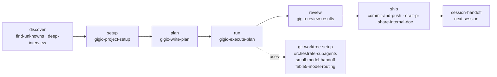

# gigio-pack

A work loop for one person running a project too big to hold in one session.

It keeps the intent, the plan, and the record of what actually happened in files — so the next session, the next model, and the next harness pick the work up where it was left, instead of re-deriving it. 17 skills, all plain markdown you can read and hand-edit.

[Why](#why-this-exists) · [Work loop](#the-work-loop) · [Catalog](#skill-catalog) · [Invocation](#nothing-expensive-starts-on-its-own) · [Install](#install) · [Domain skills](#pair-it-with-domain-skills) · [Scope](#scope) · [Why it looks like this](#why-it-looks-like-this) · [Status](#status) · [Contributing](CONTRIBUTING.md)

## Why this exists

I have used a lot of agent skill packs and harnesses. The ones that ended up in my way shared a shape: a thick layer between me and the model — routers, state machines, generated scaffolding — that spent the model's capability on following the framework. A strong model follows a badly designed procedure just as faithfully as a good one, which makes procedure the most expensive thing you can add. I wanted the model's own strength, with as little machinery on top as the job allows.

The part that actually hurt was elsewhere. Working solo on something large enough to span product planning, creative direction, implementation, and QA, the engineering half was already the half that worked. Everything around it kept falling out of the loop: the reason the project exists, the calls that were already settled, the work whose result is judged rather than tested. The pack centers on that loop, with one explicit language-specific addition: reusable Python coding decisions that otherwise need to be restated during implementation.

| What breaks on a long solo project | Without a durable layer | With this pack |
| --- | --- | --- |
| A new session does not know why the project exists | The goal gets re-derived from the code, and settled calls get quietly re-opened | `PROJECT.md` carries the diagnosis, pillars, non-goals, and judgment rules; its top half is yours and needs your approval to change |
| The plan lives in the conversation | Compaction or a fresh session loses it, and another model cannot pick it up | The plan is a file whose top half is your goal and limits in your own words, and whose staged tasks carry needs, owned paths or resources, acceptance, and checks. A solo session reads it top to bottom; a lead dispatches workers from the same file; another harness runs it from its header |
| "Done" arrives as a summary | A confident narrative passes for a finished result | A task closes only with its results entry filled, real change in its owned paths, and a check that ran on fresh output |
| The work is not code | A design call, a playtest, a research run has no shape the task list accepts | `acceptance` and `check` are separate axes — acceptance can be a judged result or a stated finding; a task's unit can be a run or an external resource instead of a file; the plan is anchored to a commit, a snapshot, or a revision; and `.plans/` sits under whatever root you work from, repository or not |
| The session that built it also reviews it | The reviewer defends its own plan | Review runs in fresh context off the disk — diffs, files, re-run checks — not off the executor's report |

Four rules keep the machinery thin:

- **Nine procedural skills wait to be asked.** The terminology pair applies on every task by default, maintaining relevant records as material is encountered.
- **Everything is markdown a person can read and correct.** No daemons, hooks, watchdogs, or runtime state files.
- **Numbered steps only where order is part of correctness** — a prerequisite read, an approval boundary, a required output, a check. Elsewhere the skill states the destination and the stopping condition and leaves the route to the model.
- **The durable layer holds intent and record format, never compensating procedure.** A step that can be dropped without losing correctness, safety, or the ability to audit the run gets dropped.

## The work loop



Each station names the next one; the arrows do not grant permission to start it. A planning-only request ends at the saved plan. A request that already includes execution continues through `gigio-execute-plan` after planning; execution records what it learns and keeps going instead of stopping to renegotiate; review starts from the disk, in a session that built nothing. The one exception to naming-and-stopping is a run already underway: `gigio-execute-plan` calls `git-worktree-setup`, `small-model-handoff`, and `commit-and-push` itself.

The purpose and the outcome are in the name — `gigio-write-plan` writes a plan, `gigio-execute-plan` executes one, `session-handoff` hands a session to the next one, `small-model-handoff` hands bounded work to a weaker model, `share-internal-doc` shapes findings into a document to share with colleagues.

## Skill catalog

Four core skills own the durable files and the boundaries between stations. Of the other thirteen, three are name-called by a core skill during a run you started; every one of the seventeen can also be invoked directly when you need only that one thing. Nine require explicit requests; both terminology skills apply on every task, and the Python skill applies within requested Python work — see [Invocation](#nothing-expensive-starts-on-its-own).

### Core loop

| Skill | What it does |
| --- | --- |
| [gigio-project-setup](skills/gigio-project-setup/) | Writes or audits `PROJECT.md` — why the project exists, its pillars and non-goals, the numbered judgment rules, the current risk and position — and wires `AGENTS.md` plus a `CLAUDE.md` bridge so later sessions actually read it |
| [gigio-write-plan](skills/gigio-write-plan/) | Turns chosen work into one plan file in `.plans/`: your goal and limits at the top in your own words, then staged tasks carrying needs, owned paths or resources, acceptance, and checks, anchored to PROJECT.md or whatever intent document the project has. Announces the path and the lines it proposed; execution uses `gigio-execute-plan` only when requested |
| [gigio-execute-plan](skills/gigio-execute-plan/) | Executes or resumes a plan: preflight against what the plan was planned against, parallel workers on disjoint paths or resources, a run log that survives compaction, and a completion judgment the lead makes rather than the worker |
| [gigio-review-results](skills/gigio-review-results/) | Reviews finished or long-running work in fresh context against your own words at the top of the plan, re-collecting the facts itself — files, run outputs, external resources, re-run checks — and returns three lists — missing, built but not asked, misunderstood — each routed by cause, plus the work that rests on lines you never confirmed |

### Before the loop

| Skill | What it does |
| --- | --- |
| [find-unknowns](skills/find-unknowns/) | Picks the single cheapest discovery technique — blindspot brief, option map, throwaway variants, mini-interview, reference request — and compresses what it finds into a launch brief the plan can consume |
| [deep-interview](skills/deep-interview/) | Socratic requirements discovery, one question per turn, ending in an interview brief you approve |

### Inside a run

| Skill | What it does |
| --- | --- |
| [orchestrate-subagents](skills/orchestrate-subagents/) | Judges whether parallel delegation actually helps, writes the self-contained worker packets, and synthesizes the results instead of concatenating them |
| [git-worktree-setup](skills/git-worktree-setup/) | Gives a worker an isolated workspace, reusing existing isolation and otherwise keeping Git-created worktrees under the repository's `.worktrees/` directory |
| [small-model-handoff](skills/small-model-handoff/) | Turns already-approved work into a bounded prompt for an executor weaker than the planner |
| [fable5-model-routing](skills/fable5-model-routing/) | Decides which model role owns the judgment and which lane gets the bounded follow-on work; self-excludes outside Claude Code and Cursor |
| [python-coding-standards](skills/python-coding-standards/) | Keeps Python code straightforward: Pydantic-first models, explicit Python 3.12+ types including locals and SDK objects, uv-managed dependencies, stable `StrEnum` values, cohesive modules, and explanations close to code; uses the official external `pydantic` skill for library guidance |

### Shared terminology across the loop

| Skill | What it does |
| --- | --- |
| [curate-terminology](skills/curate-terminology/) | Defines, researches, updates, and records project terminology and expressions, with primary sources, literature provenance, anti-patterns, and standing project instructions |
| [use-terminology](skills/use-terminology/) | Looks up and applies accepted terminology and expressions, preserving contextual meaning and correcting authorized artifacts while the original task continues |

Both terminology skills apply on every task, including tasks that do not mention wording. `curate-terminology` maintains relevant definitions and expressions as they are encountered; `use-terminology` applies them. Curation studies established projects, influential papers, and accountable author or maintainer explanations, including verbs, collocations, and how a project is described. AI-generated derivative writing is not a wording authority. AI-related project documentation receives heightened scrutiny for unsupported labels and claims; the named examples are cautionary cases, not a fixed denylist. Project setup writes the standing instruction; downloading skill files alone cannot guarantee host loading. Company proper names and local meanings are recorded separately from industry usage; ask the user about the few unresolved cases and reuse the confirmed answers. Root `terminology.md` holds representative definitions and an index. Detailed terms, expressions, and local meanings live in topic files under `docs/terminology/`; `docs/terminology/references.md` records their sources separately, with links from the supported entries. These are files in the consuming project, not mutable data stored in the installed skill.

### Out of the loop

| Skill | What it does |
| --- | --- |
| [commit-and-push](skills/commit-and-push/) | Close-out commits and safe pushes, leaving unrelated worktree changes untouched |
| [draft-pr](skills/draft-pr/) | Publishes, updates, or explicitly squash-merges a real GitHub or Forgejo PR through authenticated `gh` or `fj`, draft or work-in-progress by default |
| [session-handoff](skills/session-handoff/) | Packages live work as one executable prompt file for the next session |
| [share-internal-doc](skills/share-internal-doc/) | Shapes research, analysis, and decisions into a document a colleague can read without the session: one reader, claims traceable to sources a colleague can open, a reading rule for what records cannot show, a dark color scheme unless light is asked for, and a sharing pass before it leaves the machine; prose, Korean, figures, and Notion styling delegated to the skills that own them |

The two handoff skills are a deliberate pair: `session-handoff` hands work to the **next session**, `small-model-handoff` hands bounded work to a **weaker model**. The target is in the name. `share-internal-doc` is the third exit: code leaves a session as a PR, findings leave it as a document.

## Nothing expensive starts on its own

Nine of the seventeen have explicit request triggers. They open when you name the skill, ask for what it does, or another pack skill name-calls it inside a run you already started. Not because a task looked big, a domain looked unfamiliar, a spec was missing, or a session ran long.

| Waits to be asked | What opening it costs you |
| --- | --- |
| the four core skills | `PROJECT.md`, a plan file, a run, a re-collection pass over the repository |
| `session-handoff` | a handoff prompt file |
| `share-internal-doc` | a document file and a sharing pass over its contents |
| `orchestrate-subagents`, `small-model-handoff`, `fable5-model-routing` | a fan-out, a weaker executor, a different model |

The other five retain their existing trigger policy. `deep-interview`, `commit-and-push`, `draft-pr`, and `git-worktree-setup` only fire on something you said anyway — ask for an interview, say commit, say PR, ask for isolation.

The terminology pair is a standing exception: use both on every task and update relevant records when needed. No change means no artificial write or new survey. Explicit read-only restrictions still apply.

`python-coding-standards` applies while writing, refactoring, or reviewing Python code, or setting up a Python project, already requested by the user. It does not start a plan, a repository-wide audit, or a refactor merely because a Python file is large. Review and diagnosis remain read-only.

`find-unknowns` is the separate discovery exception that may open from the situation rather than the request. It is supposed to reach you before you know to ask, and the worst it can do uninvited is a paragraph you skip.

Practically: discussing a project, however large, does not put a file in your repository. Say "plan this" to get one.

## Install

Install globally for the agents you use:

```bash
npx --yes skills add 'gigio1023/gigio-pack#main' \
  --global \
  --agent claude-code --agent codex --agent cursor \
  --skill '*' \
  --yes
```

Drop the trailing `--yes` to review the overwrite summary in an interactive terminal — recommended whenever the install would replace an existing global skill of the same name. Always pass an explicit `--agent` list; the CLI otherwise installs for whatever agent it detects.

A global install **copies** the files rather than symlinking them. Installing from the GitHub source above records the origin, so `npx skills update` picks up later releases; installing from a local checkout does not, and re-running `add` is then the only update path. Either way, editing a skill in a checkout changes nothing globally until you install again.

Read the source before installing it. That advice applies to this pack as much as to any other — see [Ecosystem caution](docs/prior-art.md#ecosystem-caution).

### Official Pydantic companion

Pydantic is the external skill selected for Python-specific library guidance. The rest of `python-coding-standards` is authored in this pack. For Pydantic work, install only the official general `pydantic` skill from the reviewed revision:

```bash
npx --yes skills add 'pydantic/skills#9e9390ee24d44b32cf5379c58acaebd7563f5f86' \
  --global \
  --agent claude-code --agent codex --agent cursor \
  --skill pydantic \
  --yes
```

This is a separate, optional installation; installing gigio-pack does not install Pydantic's skills or Python packages. If the companion is absent, the [integration reference](skills/python-coding-standards/references/pydantic-integration.md) directs the agent to the reviewed upstream file, with official documentation as a fallback. It does not require Pydantic AI or Logfire. Review upstream changes before selecting a newer revision.

## Pair it with domain skills

The work loop benefits from domain knowledge installed next to it, because it then has something specific to plan against and to judge acceptance by. The included Python skill supplies the owner's coding preferences; framework and application-domain knowledge remain separate.

The Python preference is organized code, not clever architecture. Application-owned records use Pydantic unless another representation is concretely necessary; declarations include explicit local and SDK types. Python 3.12+ and uv project management are the setup defaults, with runtime and development dependencies recorded separately. Implementation explanations belong in docstrings and comments; policy and information that cannot be explained locally may live in `docs/`. Existing compatibility constraints require an explicit exception or scoped migration, not an accidental break.

| Alongside | Repository | What it brings that this pack cannot |
| --- | --- | --- |
| Pydantic models | [pydantic/skills](https://github.com/pydantic/skills) | Official `pydantic` guidance for constraints, validators, coercion, and model hierarchies; see the [companion setup](#official-pydantic-companion) |
| Godot projects | [gigio1023/godot-best-practice](https://github.com/gigio1023/godot-best-practice) | Version-matched engine APIs; `.tscn`/`.tres` handled as serialized engine data — `ExtResource`/`SubResource` IDs, UIDs, `NodePath`s, `res://` import boundaries — rather than as text; dependencies composed at the owning scene through references and signals instead of `/root/...` lookups; and completion proved at the parse, import, scene-load, runtime, or export layer instead of by a clean diff |
| Game development in general | [gigio1023/game-studio](https://github.com/gigio1023/game-studio) | Direction work — concept slate, creative brief, Direction Lock — plus production that plans each milestone as a playable build retiring the biggest open question, milestone sign-off as READY / CONCERNS / NOT READY, and a routed game-craft knowledge layer (juice, pricing, wishlists, IP assignment) whose numbers carry dated citations |

The seam is clean: a game's pillars and judgment rules are what a creative brief settles, a milestone becomes the goal of a plan file, a playable build is what that plan's acceptance names, and an engine-layer check is what verifies it.

Other skills I keep for my own work live in [gigio1023/agent-skills](https://github.com/gigio1023/agent-skills) — delegation to other CLIs (`codex-delegate` for bounded `codex exec` runs with durable run artifacts and explicit resume, `cursor-cli-delegation` for a closed mission through Cursor Agent CLI), craft skills for docs, diagrams, docstrings, and prompt review, and the skill-authoring tooling. None of the 17 skills here require those external packages; `share-internal-doc` names `slop-aware-writing`, `korean-clarity`, `notion-doc`, and the gigio-figures skills only where they are installed, so the two sets install independently.

## Scope

The pack covers the work loop and the explicitly selected Python coding standard:

- **In:** durable project intent, plans as files, execution with a run log, fresh-context review, durable project terminology and expression decisions, and the exits from a session: a handoff to the next session, bounded work to a weaker model, code as a PR, and findings as a document colleagues can read without the session. Python modeling, typing, enum, module, environment, source-explanation, and verification preferences also apply during requested work.
- **Out:** a supplied domain glossary and other general craft. Prose style, diagram conventions, engine specifics, design taste — those belong to skills that own the domain, and the loop is where they get applied. Shaping a document for a reader who lacks the session (its reader, spine, format, claim status, sharing pass, medium) is loop work, not craft; `share-internal-doc` owns it and delegates the prose, Korean, figures, and Notion styling. Pydantic library guidance stays with its official external skill; no third-party Python or modularity pack is bundled.
- **Also out:** anything that is not a markdown file a person can read. No background processes, no generated state, no framework that has to be running for the skills to work — and no unrelated work started merely because a conversation looks substantial. The terminology pair's in-task maintenance is an explicit standing policy.

Terminology records preserve decisions and their sources across sessions; they do not supply universal domain definitions or replace a writing-style skill.

Other craft work still uses the skills available in the session. The Python addition is a user-selected scope change, not a requirement to add every language or framework to the pack. That choice and the document exit's place in the loop are recorded in [docs/decisions.md](docs/decisions.md).

## Why it looks like this

The pack is the residue of several assemblies that were built, used, and thrown away. The reasoning is written down so that changing it later does not mean reconstructing the argument:

| Document | What it answers |
| --- | --- |
| [docs/principles.md](docs/principles.md) | The constraints every part must satisfy, and what they rule out |
| [docs/rule-ledger.md](docs/rule-ledger.md) | Why each load-bearing rule is allowed to exist, and when it expires |
| [docs/decisions.md](docs/decisions.md) | What was tried, what reality revealed, what was chosen instead |
| [docs/prior-art.md](docs/prior-art.md) | What was surveyed, adopted, rejected, and deferred |

The shortest version: put intent and record format in the durable layer, never compensating procedure — because a strong model follows a badly designed procedure just as faithfully as a good one.

## Status

- Plan file generalized 2026-09-11 from three real plans, two of them outside ordinary code work: a user-owned top half in the user's words, `owns` covering paths, run directories, and external resources, `Planned against` anchors in place of a single commit, and `Judged against` for projects without a PROJECT.md; the review station reads your half first and flags work built on lines you never confirmed. Based on where the format broke, not on measured user correction — the entry in [docs/decisions.md](docs/decisions.md) says what is withheld until that measurement.
- Python coding standards authored 2026-09-10 and refined to the owner's Pydantic-first, explicit-typing, uv, and source-local documentation preferences. The official Pydantic companion remains external. Package validation does not establish model behavior or complete the work-loop pilots.
- Terminology curation and application skills added 2026-09-10 from a completed project workflow; package validation is separate from runtime behavior testing.
- Core-loop skills authored 2026-07-26 to the `skill-builder` contract kept in agent-skills; migrated skills keep their original bodies plus a minimal interlock pass (sibling references, next-station pointers, plan-file awareness).
- Dual-reviewed 2026-07-26 by two independent reviewers from different model families; all confirmed findings fixed, reviewed-and-kept verdicts recorded in [docs/rule-ledger.md](docs/rule-ledger.md).
- `share-internal-doc` authored 2026-09-09 as `write-internal-doc` from a harvest of the author's own document corrections across four harnesses and a survey of about thirty public documentation skills; renamed 2026-09-10, the day dark became its default color scheme; not yet piloted.
- **Not yet piloted.** Nothing is marked done until two pilot projects pass. They measure whether parallel writing actually pays off, whether the plan file carries enough for handoff between workers, which steps the lead demonstrably did not need, and what the acceptance field gets filled with outside ordinary code work.

## Local development

See [CONTRIBUTING.md](CONTRIBUTING.md) for the skill contract, the verification checklist, and the design-record rules. Quick check after any edit:

```bash
npx --yes skills add . --list --full-depth   # must report exactly 17
```
