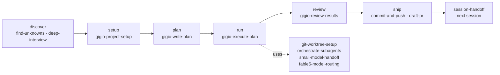

# gigio-pack

A work loop for one person running a project too big to hold in one session.

It keeps the intent, the plan, and the record of what actually happened in
files — so the next session, the next model, and the next harness pick the
work up where it was left, instead of re-deriving it. 13 skills, all plain
markdown you can read and hand-edit.

[Why](#why-this-exists) · [Work loop](#the-work-loop) ·
[Catalog](#skill-catalog) · [Invocation](#nothing-expensive-starts-on-its-own) ·
[Install](#install) ·
[Domain skills](#pair-it-with-domain-skills) · [Scope](#scope) ·
[Why it looks like this](#why-it-looks-like-this) · [Status](#status) ·
[Contributing](CONTRIBUTING.md)

## Why this exists

I have used a lot of agent skill packs and harnesses. The ones that ended up in
my way shared a shape: a thick layer between me and the model — routers, state
machines, generated scaffolding — that spent the model's capability on
following the framework. A strong model follows a badly designed procedure just
as faithfully as a good one, which makes procedure the most expensive thing you
can add. I wanted the model's own strength, with as little machinery on top as
the job allows.

The part that actually hurt was elsewhere. Working solo on something large
enough to span product planning, creative direction, implementation, and QA,
the engineering half was already the half that worked. Everything around it
kept falling out of the loop: the reason the project exists, the calls that
were already settled, the work whose result is judged rather than tested. So
this pack is small on purpose — it holds the loop, and nothing else.

| What breaks on a long solo project | Without a durable layer | With this pack |
| --- | --- | --- |
| A new session does not know why the project exists | The goal gets re-derived from the code, and settled calls get quietly re-opened | `PROJECT.md` carries the diagnosis, pillars, non-goals, and judgment rules; its top half is yours and needs your approval to change |
| The plan lives in the conversation | Compaction or a fresh session loses it, and another model cannot pick it up | The plan is a file: staged tasks with needs, owned files, acceptance, and checks. A solo session reads it top to bottom; a lead dispatches workers from the same file |
| "Done" arrives as a summary | A confident narrative passes for a finished result | A task closes only with its results entry filled, real change in its owned paths, and a check that ran on fresh output |
| The work is not code | A design call, a playtest, a research run has no shape the task list accepts | `acceptance` and `check` are separate axes — acceptance can be a judged result or a stated finding, and a task's unit can be a run instead of a file |
| The session that built it also reviews it | The reviewer defends its own plan | Review runs in fresh context off the disk — diffs, files, re-run checks — not off the executor's report |

Four rules keep the machinery thin:

- **Nothing that writes or spends opens unless you open it.** Eight of the
  thirteen wait to be asked; the rest cost nothing when they misfire.
- **Everything is markdown a person can read and correct.** No daemons, hooks,
  watchdogs, or runtime state files.
- **Numbered steps only where order is part of correctness** — a prerequisite
  read, an approval boundary, a required output, a check. Elsewhere the skill
  states the destination and the stopping condition and leaves the route to the
  model.
- **The durable layer holds intent and record format, never compensating
  procedure.** A step that can be dropped without losing correctness, safety,
  or the ability to audit the run gets dropped.

## The work loop



Each station names the next one and stops there — the arrows are what to say
next, not a chain that advances by itself. Planning writes the file and stops;
execution records what it learns and keeps going instead of stopping to
renegotiate; review starts from the disk, in a session that built nothing. The
one exception to naming-and-stopping is a run already underway:
`gigio-execute-plan` calls `git-worktree-setup`, `small-model-handoff`, and
`commit-and-push` itself.

The purpose and the outcome are in the name — `gigio-write-plan` writes a plan,
`gigio-execute-plan` executes one, `session-handoff` hands a session to the
next one, `small-model-handoff` hands bounded work to a weaker model.

## Skill catalog

Four core skills own the durable files and the boundaries between stations. Of
the other nine, three are name-called by a core skill during a run you started;
every one of the thirteen can also be invoked directly when you need only that
one thing. Eight of them never open unless asked — see
[Invocation](#nothing-expensive-starts-on-its-own).

### Core loop

| Skill | What it does |
| --- | --- |
| [gigio-project-setup](skills/gigio-project-setup/) | Writes or audits `PROJECT.md` — why the project exists, its pillars and non-goals, the numbered judgment rules, the current risk and position — and wires `AGENTS.md` plus a `CLAUDE.md` bridge so later sessions actually read it |
| [gigio-write-plan](skills/gigio-write-plan/) | Turns chosen work into one plan file in `.plans/`: staged tasks carrying needs, owned files, acceptance, and checks, anchored to a judgment rule. Announces the path and stops — it never executes |
| [gigio-execute-plan](skills/gigio-execute-plan/) | Executes or resumes a plan: preflight against the planning commit, parallel workers on disjoint files, a run log that survives compaction, and a completion judgment the lead makes rather than the worker |
| [gigio-review-results](skills/gigio-review-results/) | Reviews finished or long-running work in fresh context, re-collecting the facts itself, and returns three lists — missing, built but not asked, misunderstood — each routed by cause |

### Before the loop

| Skill | What it does |
| --- | --- |
| [find-unknowns](skills/find-unknowns/) | Picks the single cheapest discovery technique — blindspot brief, option map, throwaway variants, mini-interview, reference request — and compresses what it finds into a launch brief the plan can consume |
| [deep-interview](skills/deep-interview/) | Socratic requirements discovery, one question per turn, ending in an interview brief you approve |

### Inside a run

| Skill | What it does |
| --- | --- |
| [orchestrate-subagents](skills/orchestrate-subagents/) | Judges whether parallel delegation actually helps, writes the self-contained worker packets, and synthesizes the results instead of concatenating them |
| [git-worktree-setup](skills/git-worktree-setup/) | Gives a worker an isolated workspace, reusing existing isolation rather than taking over one the harness already manages |
| [small-model-handoff](skills/small-model-handoff/) | Turns already-approved work into a bounded prompt for an executor weaker than the planner |
| [fable5-model-routing](skills/fable5-model-routing/) | Decides which model role owns the judgment and which lane gets the bounded follow-on work; self-excludes outside Claude Code and Cursor |

### Out of the loop

| Skill | What it does |
| --- | --- |
| [commit-and-push](skills/commit-and-push/) | Close-out commits and safe pushes, leaving unrelated worktree changes untouched |
| [draft-pr](skills/draft-pr/) | Publishes or updates a real GitHub PR through `gh`, draft by default |
| [session-handoff](skills/session-handoff/) | Packages live work as one executable prompt file for the next session |

The two handoff skills are a deliberate pair: `session-handoff` hands work to
the **next session**, `small-model-handoff` hands bounded work to a **weaker
model**. The target is in the name.

## Nothing expensive starts on its own

Eight of the thirteen wait to be asked. They open on three things: you name the
skill, you ask for what it does, or another pack skill name-calls it inside a
run you already started. Not because a task looked big, a domain looked
unfamiliar, a spec was missing, or a session ran long.

| Waits to be asked | What opening it costs you |
| --- | --- |
| the four core skills | `PROJECT.md`, a plan file, a run, a re-collection pass over the repository |
| `session-handoff` | a handoff prompt file |
| `orchestrate-subagents`, `small-model-handoff`, `fable5-model-routing` | a fan-out, a weaker executor, a different model |

The other five cost nothing when they open uninvited. `deep-interview`,
`commit-and-push`, `draft-pr`, and `git-worktree-setup` only fire on something
you said anyway — ask for an interview, say commit, say PR, ask for isolation.

`find-unknowns` is the deliberate exception, and the only skill here that may
open from the situation rather than the request. It is supposed to reach you
before you know to ask, and the worst it can do uninvited is a paragraph you
skip.

Practically: discussing a project, however large, does not put a file in your
repository. Say "plan this" to get one.

## Install

Install globally for the agents you use:

```bash
npx --yes skills add 'gigio1023/gigio-pack#main' \
  --global \
  --agent claude-code --agent codex --agent cursor \
  --skill '*' \
  --yes
```

Drop the trailing `--yes` to review the overwrite summary in an interactive
terminal — recommended whenever the install would replace an existing global
skill of the same name. Always pass an explicit `--agent` list; the CLI
otherwise installs for whatever agent it detects.

A global install **copies** the files rather than symlinking them. Installing
from the GitHub source above records the origin, so `npx skills update` picks
up later releases; installing from a local checkout does not, and re-running
`add` is then the only update path. Either way, editing a skill in a checkout
changes nothing globally until you install again.

Read the source before installing it. That advice applies to this pack as much
as to any other — see [Ecosystem caution](docs/prior-art.md#ecosystem-caution).

## Pair it with domain skills

This pack knows how work moves, not how your domain works. It gets noticeably
better when domain knowledge is installed next to it, because the loop then has
something specific to plan against and to judge acceptance by.

| Alongside | Repository | What it brings that this pack cannot |
| --- | --- | --- |
| Godot projects | [gigio1023/godot-best-practice](https://github.com/gigio1023/godot-best-practice) | Version-matched engine APIs; `.tscn`/`.tres` handled as serialized engine data — `ExtResource`/`SubResource` IDs, UIDs, `NodePath`s, `res://` import boundaries — rather than as text; dependencies composed at the owning scene through references and signals instead of `/root/...` lookups; and completion proved at the parse, import, scene-load, runtime, or export layer instead of by a clean diff |
| Game development in general | [gigio1023/game-studio](https://github.com/gigio1023/game-studio) | Direction work — concept slate, creative brief, Direction Lock — plus production that plans each milestone as a playable build retiring the biggest open question, milestone sign-off as READY / CONCERNS / NOT READY, and a routed game-craft knowledge layer (juice, pricing, wishlists, IP assignment) whose numbers carry dated citations |

The seam is clean: a game's pillars and judgment rules are what a creative brief
settles, a milestone becomes the goal of a plan file, a playable build is what
that plan's acceptance names, and an engine-layer check is what verifies it.

Other skills I keep for my own work live in
[gigio1023/agent-skills](https://github.com/gigio1023/agent-skills) — delegation
to other CLIs (`codex-delegate` for bounded `codex exec` runs with durable run
artifacts and explicit resume, `cursor-cli-delegation` for a closed mission
through Cursor Agent CLI), craft skills for docs, diagrams, docstrings,
terminology, and prompt review, and the skill-authoring tooling. None of the 13
skills here reference any of them, so the two sets install independently.

## Scope

The pack covers the loop and stops there:

- **In:** durable project intent, plans as files, execution with a run log,
  fresh-context review, and the handoffs out of a session.
- **Out:** domain knowledge and craft. Writing style, diagram conventions,
  engine specifics, design taste — those belong to skills that own the domain,
  and the loop is where they get applied.
- **Also out:** anything that is not a markdown file a person can read. No
  background processes, no generated state, no framework that has to be running
  for the skills to work — and no skill that writes a file or spends on your
  behalf because it decided a conversation needed it.

Craft work still happens during a run; it just uses whichever craft skills the
session has installed, rather than skills this pack ships.

## Why it looks like this

The pack is the residue of several assemblies that were built, used, and thrown
away. The reasoning is written down so that changing it later does not mean
reconstructing the argument:

| Document | What it answers |
| --- | --- |
| [docs/principles.md](docs/principles.md) | The constraints every part must satisfy, and what they rule out |
| [docs/rule-ledger.md](docs/rule-ledger.md) | Why each load-bearing rule is allowed to exist, and when it expires |
| [docs/decisions.md](docs/decisions.md) | What was tried, what reality revealed, what was chosen instead |
| [docs/prior-art.md](docs/prior-art.md) | What was surveyed, adopted, rejected, and deferred |

The shortest version: put intent and record format in the durable layer, never
compensating procedure — because a strong model follows a badly designed
procedure just as faithfully as a good one.

## Status

- Core-loop skills authored 2026-07-26 to the `skill-builder` contract kept in
  agent-skills; migrated skills keep their original bodies plus a minimal
  interlock pass (sibling references, next-station pointers, plan-file
  awareness).
- Dual-reviewed 2026-07-26 by two independent reviewers from different model
  families; all confirmed findings fixed, reviewed-and-kept verdicts recorded
  in [docs/rule-ledger.md](docs/rule-ledger.md).
- **Not yet piloted.** Nothing is marked done until two pilot projects pass.
  They measure whether parallel writing actually pays off, whether the plan
  file carries enough for handoff between workers, which steps the lead
  demonstrably did not need, and what the acceptance field gets filled with
  outside ordinary code work.

## Local development

See [CONTRIBUTING.md](CONTRIBUTING.md) for the skill contract, the
verification checklist, and the design-record rules. Quick check after any
edit:

```bash
npx --yes skills add . --list --full-depth   # must report exactly 13
```
